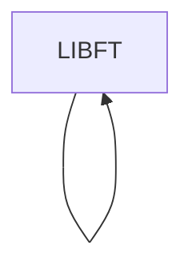
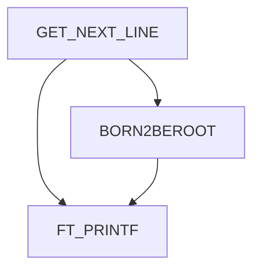

# 42cursus
Hi there ✋!

```mermaid
graph TD;
    LIBFT --> LIBFT;
```

```mermaid
graph TD;
    GET_NEXT_LINE --> FT_PRINTF;
    GET_NEXT_LINE --> BORN2BEROOT
    BORN2BEROOT --> FT_PRINTF
```

| Projects | Mark |
| --- | --- |
| `Libft` ||
| `ft_printf` |  |
| `get_next_line` |  |

